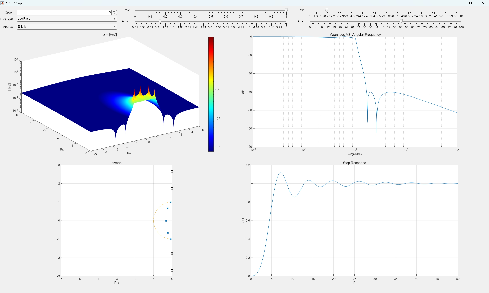

# Analog Filter Prototype Visualizer

[](https://www.mathworks.com/products/matlab.html) [](LICENSE)

A MATLAB App Designer tool for **intuitive visualization of analog filter prototypes**. It helps engineers and students quickly evaluate filter frequency responses, assess compliance with design specifications, and select the most suitable filter prototype (Butterworth, Chebyshev, Bessel, Elliptic, etc.) for low-pass and high-pass designs.

  
*Example: Main interface showing magnitude response and pole-zero plot.*

---

## ✨ Features

- **Interactive Filter Prototype Analysis**  
  - Plot magnitude response (normalized frequency)  
  - Display unit step response (time domain)  
  - Visualize pole-zero diagram in the s‑plane  
  - 3D surface plot of the transfer function magnitude over the s‑plane  

- **Supported Filter Types**  
  - Butterworth  
  - Chebyshev Type I  
  - Chebyshev Type II  
  - Bessel  
  - Elliptic (Cauer)  

- **Filter Configuration**  
  - Low-pass and high-pass prototypes  
  - Adjustable filter order  
  - Real‑time updates of all plots  

- **Design Aid**  
  Quickly compare different prototypes against your design specifications (passband ripple, stopband attenuation, etc.)

---

## 🧪 Supported Filter Prototypes

| Type           | Characteristics                                 |
|----------------|-------------------------------------------------|
| Butterworth    | Maximally flat passband, smooth roll‑off        |
| Chebyshev I    | Equiripple in passband, sharper cutoff          |
| Chebyshev II   | Equiripple in stopband, flat passband           |
| Bessel         | Maximally flat group delay (linear phase)       |
| Elliptic       | Equiripple in both bands, sharpest cutoff       |

All filters are analog prototypes, designed for **low‑pass** and **high‑pass** responses.

---

## 🚀 Getting Started

### Prerequisites

- **MATLAB** R2023b or later (App Designer required) 
- **Signal Processing Toolbox** (for filter coefficient calculations)

### Installation

1. Clone this repository:
   ```bash
   git clone https://github.com/yourusername/analog-filter-visualizer.git
   ```
2. Open MATLAB and navigate to the cloned folder.
3. Run the app by double‑clicking `FilterApp.mlapp` in the MATLAB Current Folder browser, or type the following in the Command Window:
   ```matlab
   run('FilterApp.mlapp')
   ```

The app GUI will launch, ready for you to explore filter prototypes.

---

## 🖱️ Usage

1. Select a **filter type** from the drop‑down menu.  
2. Choose **low‑pass** or **high‑pass** prototype.  
3. Set the desired **filter order**.  
4. Adjust parameters (ripple, stopband attenuation) when applicable (e.g., Chebyshev ripple in dB).  
5. View the automatically updated plots:  
   - Magnitude response (normalized frequency)  
   - Unit step response  
   - Pole‑zero map  
   - 3D surface plot of |H(s)| over the s‑plane  

You can overlay multiple prototypes or export figures for reports.


---

## 📄 License

This project is licensed under the GPL License – see the [LICENSE](LICENSE) file for details.

---

## 📬 Contact

For questions or suggestions, please [open an issue](https://github.com/yourusername/analog-filter-visualizer/issues) or contact [suoxm@zju.edu.cn](mailto:suoxm@zju.edu.cn).

---

**Happy filtering!**